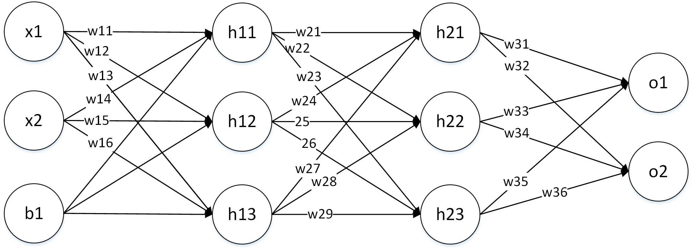

<!--
 * @Descripttion: 
 * @version: 
 * @Author: SunZewen
 * @Date: 2019-08-01 17:20:22
 * @LastEditors: SunZewen
 * @LastEditTime: 2019-08-10 12:55:33
 -->
# 多层感知机 （multilayer perceptron，MLP）

## 一、 隐藏层

## 二、神经网络模型
示例为一个三层网络模型，包含两层隐藏层。

## 2.1 前向传播

第一层
$$
h_{11} = w_{11}*x_{1} + w_{14} * x_{2} + b_{1} \\
h_{12} = w_{12}*x_{1} + w_{15} * x_{2} + b_{1} \\
h_{13} = w_{13}*x_{1} + w_{16} * x_{2} + b_{1}
$$

第二层
$$
h_{21} = w_{21}*h_{11} + w_{24} * h_{12} + w_{27} * h_{13} \\
h_{22} = w_{22}*h_{11} + w_{25} * h_{12} + w_{27} * h_{13} \\
h_{23} = w_{23}*h_{11} + w_{26} * h_{12} + w_{27} * h_{13}
$$

第三层
$$
o_{1} = w_{31}*h_{21} + w_{33} * h_{22} + w_{35} * h_{23} \\
o_{2} = w_{32}*h_{21} + w_{34} * h_{22} + w_{36} * h_{23}
$$

误差计算 

$$
误差公式 \qquad E = \frac{1}{2} (\hat{y} - y)^2 \\
E_{total} = E_{o1} + E_{o2}
$$

## 2.2 反向传播

第一层
$$
\frac{\partial E_{total}}{\partial w_{31}} =  \frac{\partial o}{\partial}
$$

第二层
$$
h_{21} = w_{21}*h_{11} + w_{24} * h_{12} + w_{27} * h_{13} \\
h_{22} = w_{22}*h_{11} + w_{25} * h_{12} + w_{27} * h_{13} \\
h_{23} = w_{23}*h_{11} + w_{26} * h_{12} + w_{27} * h_{13}
$$

第三层
$$
o_{1} = w_{31}*h_{21} + w_{33} * h_{22} + w_{35} * h_{23} \\
o_{2} = w_{32}*h_{21} + w_{34} * h_{22} + w_{36} * h_{23}
$$

误差计算 

$$
误差公式 \qquad E = \frac{1}{2} (\hat{y} - y)^2 \\
E_{total} = E_{o1} + E_{o2}
$$